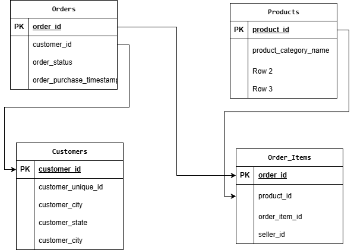
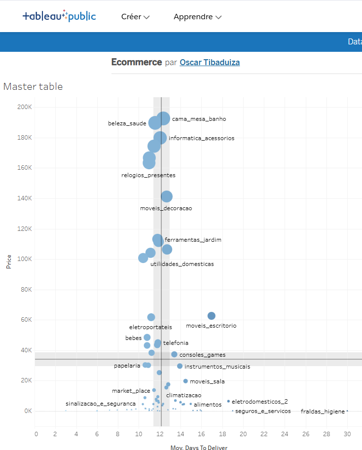

# 📦 Olist E-Commerce Supply Chain Analysis

## 📌 Project Description
Analysis of the Brazilian E-Commerce public dataset to evaluate logistics performance and sales distribution. This project focuses on **relational modeling**, joining multiple tables to extract insights about delivery times vs. estimated deadlines.

## 📊 Interactive Dashboard
[](https://public.tableau.com/views/Ecommerce_17666808507180/Mastertable?:language=fr-FR&:sid=&:redirect=auth&:display_count=n&:origin=viz_share_link)

## 🏗 Data Architecture & Modeling
Unlike previous flat-file projects, this analysis uses a **Star Schema** approach involving relational joins.

 

## 🛠 Tech Stack
* **Modeling:** Draw.io (Entity Relationship Diagram).
* **Data Warehouse:** Google BigQuery (Multi-table ingestion).
* **SQL Logic:** `INNER JOIN` for merging Orders, Items, and Products. `TIMESTAMP_DIFF` for lead-time calculation.
* **Visualization:** Tableau Public.

## 🔎 Key Insights
* **Logistics:** The average delivery time is **X days**, with significant delays observed in the "Office Furniture" category.
* **Sales:** "Health & Beauty" and "Watches" are the top revenue-generating categories.

## 📈 Visual Analytics Strategy
This dashboard moves beyond simple reporting to provide **strategic guidance** using advanced visualization techniques.

### 1. The Efficiency-Revenue Matrix (Scatter Plot)
Instead of standard bar charts, I designed a **Quadrant Analysis** to segment product categories based on two competing KPIs:
* **Vertical Axis (Y):** Revenue Volume (Financial Impact).
* **Horizontal Axis (X):** Average Delivery Time (Logistical Efficiency).



**How to read this graph:**
* **🟢 Top-Left (Stars):** High Revenue + Fast Delivery. These are the core growth drivers.
* **🔴 Top-Right (Risks):** High Revenue + Slow Delivery. These categories (e.g., Office Furniture) frustrate many customers and risk high churn. Immediate logistics optimization is required here.
* **🎨 Semantic Coloring:** A diverging Red-Green color palette is used to instantly signal "Good" (Fast) vs "Bad" (Slow) performance, using `AVG` aggregation to avoid skewing data by volume.

---

## ☁️ Technical Architecture
Moving away from flat files, this project handles a **Relational Data Model** fully in the cloud.

* **Platform:** Google Cloud Platform (GCP).
* **Data Warehouse:** Google BigQuery.
* **Modeling:** Star Schema logic (Orders fact table joined with Dimension tables).

### Entity Relationship Diagram (ERD)
The analysis required joining three distinct tables to connect a *Product Category* (Table C) with an *Order Status* (Table A).

`Orders Table` ↔ `Order Items Table` ↔ `Products Table`

---

## 🛠 SQL Skills Applied
The SQL script performs complex data preparation directly in BigQuery to feed a lightweight dataset to Tableau.

* **Relational Joins:** Using `INNER JOIN` to merge disparate datasets.
* **Temporal Math:** Using `TIMESTAMP_DIFF` to calculate precise lead times (Delivered Date - Purchase Date).
* **Aggregation Correction:** Identifying the difference between `SUM` (Total volume) and `AVG` (Performance) metrics to avoid analytical bias in visualization.

```sql
-- Snippet: Calculating Delivery Delay
SELECT 
    product_category_name,
    TIMESTAMP_DIFF(order_delivered_customer_date, order_purchase_timestamp, DAY) AS days_to_deliver
FROM `ecommerce_data.orders` o
JOIN `ecommerce_data.items` i ON o.order_id = i.order_id
...
```
