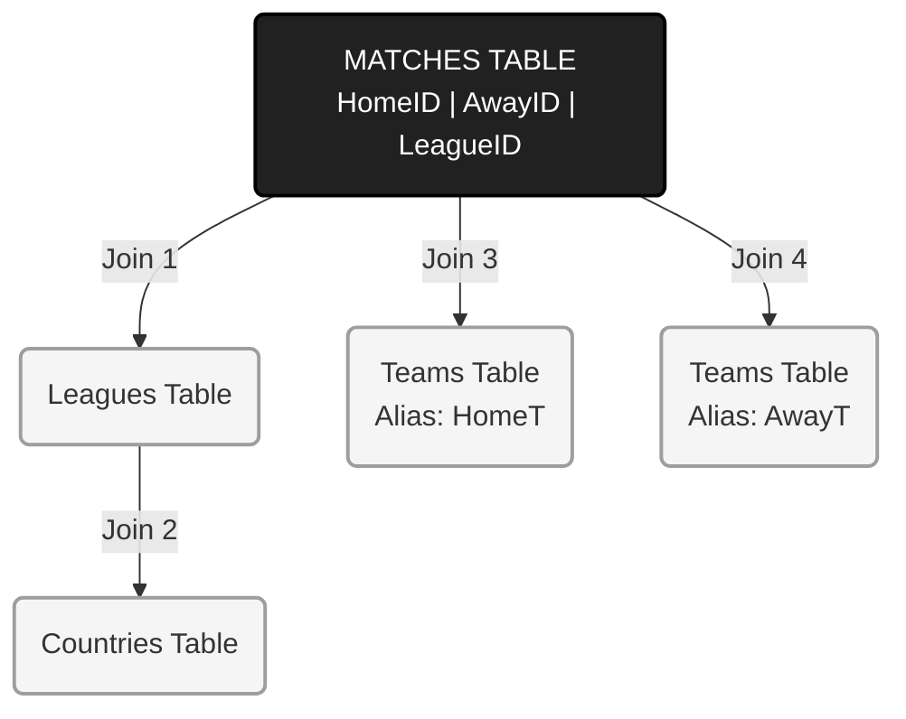

# ⚽ European Soccer Analytics (Multiple Joins)

## 📌 Project Overview
In complex databases, information is normalized across many tables to save space. To answer a simple question like "Who won the Spanish Derby?", an analyst must reconstruct the data. This project demonstrates **Multiple Joins**, connecting 4 distinct tables (Matches, Teams, Leagues, Countries) into a single analytical view.

## 📊 Interactive Dashboard
Explore the Match Results Dashboard:

[](https://public.tableau.com/views/Goalsforleague/Tableaudebord1?:language=fr-FR&:sid=&:redirect=auth&:display_count=n&:origin=viz_share_link)

## 🧠 Technical Concept: Joining 4 Tables
The challenge was to resolve IDs into human-readable names across a normalized schema.

* **Schema Topology:**
    * `Match` (Fact Table) connects to -> `League`
    * `League` connects to -> `Country`
    * `Match` connects to -> `Team` (Twice! For Home and Away sides)

### SQL Logic (The Double-Join Trick)
A key highlight is joining the `Teams` table twice using different aliases (`HomeT` and `AwayT`) to resolve both opponents in a single row.

```sql
SELECT 
    HomeT.team_long_name AS Home_Team,
    AwayT.team_long_name AS Away_Team,
    (m.home_goal + m.away_goal) AS Total_Goals
FROM matches m
JOIN teams HomeT ON m.home_team_id = HomeT.id -- Alias 1
JOIN teams AwayT ON m.away_team_id = AwayT.id -- Alias 2

```
## 🔎 Key Findings
Highest Scoring League: The data snippet shows [Nombre de la Liga] has the highest average goals per match.

Key Matchup: Verified the historical 5-0 victory of FC Barcelona over Real Madrid using the relational query.

## Architecture


