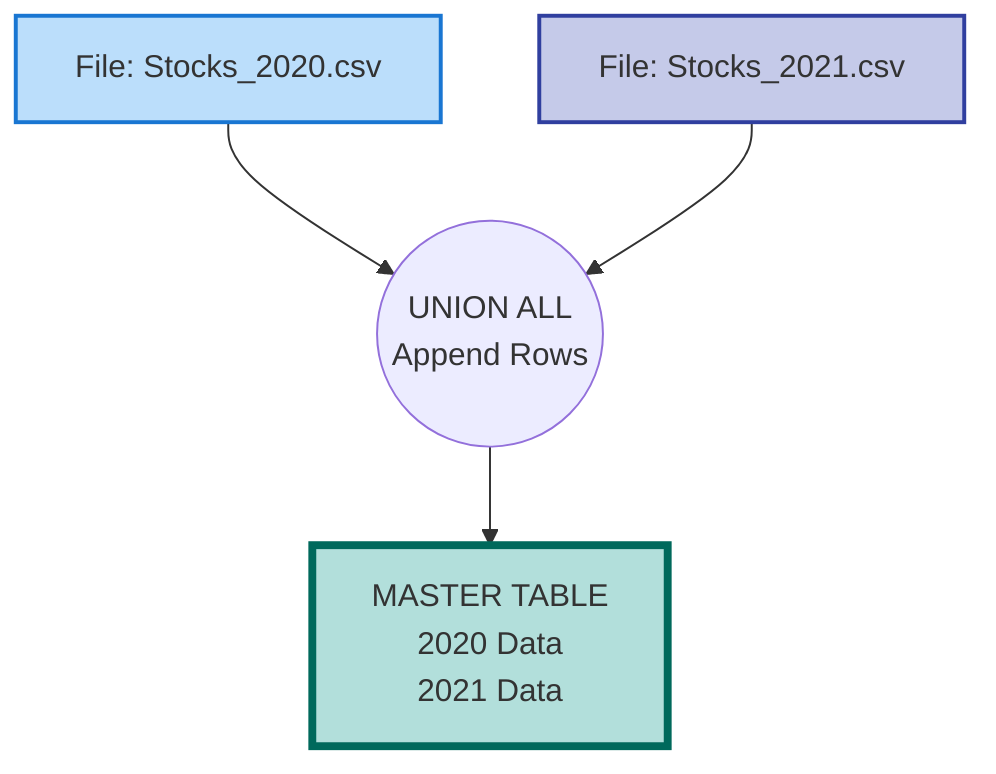

# 📈 Financial Trend Analysis (Historical Union)

## 📌 Project Overview
Financial data often arrives in fragmented, time-based reports (e.g., "Q1_Report.csv", "Q2_Report.csv"). To perform long-term trend analysis, an analyst must append these datasets vertically. This project uses **UNION ALL** to combine disparate historical files into a single continuous timeline for stock price analysis.

## 📊 Interactive Dashboard
View the Stock Trends Dashboard:

[](https://public.tableau.com/views/HistoricalAnalysis_17692054448560/Feuille1?:language=fr-FR&:sid=&:redirect=auth&:display_count=n&:origin=viz_share_link)

## 🧠 Technical Concept: UNION ALL vs JOIN
While `JOINS` are used to add columns (attributes) to existing rows, `UNIONS` are used to add new rows (records) to a dataset.

* **Scenario:** Merging 2020 Data (File A) with 2021 Data (File B).
* **Technique:** `UNION ALL` stacks the datasets on top of each other.
* **Constraint:** Both tables must have the exact same number of columns and compatible data types.

```sql
SELECT Date, Ticker, Price, '2020' AS Source FROM stocks_2020
UNION ALL
SELECT Date, Ticker, Price, '2021' AS Source FROM stocks_2021
ORDER BY Date;
```


## 🔎 Key Insights
Growth Trend: Both AAPL and GOOGL showed consistent upward trends across the unified 2-year period.

Data Integrity: The Source_File column confirms that the transition from the 2020 dataset to the 2021 dataset is seamless, with no gaps in the timeline.

## Architecture


