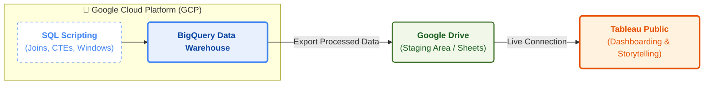

# 🚀 Data Analyst Portfolio | Oscar Tibaduiza

Hi there! I am a Data Analyst focused on **Cloud Analytics (GCP)** and **Visual Storytelling (Tableau)**. 
This repository documents my journey solving real-world business problems using a Modern Data Stack.

## 🛠️ Tech Stack & Tools
* **Cloud & Warehousing:** Google Cloud Platform (GCP), BigQuery.
* **Data Processing:** SQL (Standard & Legacy), Excel.
* **Visualization:** Tableau Public, Draw.io (Data Modeling).
* **Documentation:** Markdown, GitHub.

---

## 📂 Featured Projects

| Project | Tech Stack | Key Description | Dashboard |
| :--- | :--- | :--- | :--- |
| **01. Global Superstore** | SQL, Excel | Sales & Profit analysis for a global retailer. | |
| **02. Netflix Catalog** | BigQuery, Tableau | Content strategy analysis & trend forecasting. | [View](https://public.tableau.com/views/OscarTibaduizaNetflixContentAnalysis/Tableaudebord1?:language=fr-FR&:sid=&:redirect=auth&:display_count=n&:origin=viz_share_link) |
| **03. Data Science Salaries** | BigQuery, SQL | Market research on salaries by experience & remote work. | [View](https://public.tableau.com/views/OscarTMTopSalaries2023/Tableaudebord1?:language=fr-FR&:sid=&:redirect=auth&:display_count=n&:origin=viz_share_link) |
| **04. E-Commerce Logistics** | BigQuery, Draw.io | Supply chain optimization & Quadrant Analysis (Olist). | [View](https://public.tableau.com/views/Ecommerce_17666808507180/Mastertable?:language=fr-FR&:sid=&:redirect=auth&:display_count=n&:origin=viz_share_link) |
| **05. Customer Retention** | BigQuery, SQL | **Advanced Cohort Analysis** to measure user loyalty. | [View](https://public.tableau.com/views/OATMCustomer_Retention/Feuille1?:language=fr-FR&:sid=&:redirect=auth&:display_count=n&:origin=viz_share_link) |
| **06. HR Analytics** | BigQuery, SQL (Self Join) | Organizational hierarchy & span of control analysis. | [View](https://public.tableau.com/views/HRAnalyticsManagementSpanofContro/Tableaudebord1) |
| **07. Inventory Audit** | BigQuery, SQL (Cross Join) | Supply chain "gap detection" for missing stock. | [View](https://public.tableau.com/views/InventoryAudit/Feuille1) |
| **08. Marketing Funnel** | BigQuery, SQL (Full Join) | Data integrity audit reconciling Marketing vs Sales leads. | [View](https://public.tableau.com/views/LeadsReconciliation/Tableaudebord1?:language=fr-FR&:sid=&:redirect=auth&:display_count=n&:origin=viz_share_link) |
| **09. European Soccer** | BigQuery, SQL (Multi Join) | Complex schema denormalization (4-table join). | [View](https://public.tableau.com/views/Goalsforleague/Tableaudebord1) |
| **10. Financial Stocks** | BigQuery, SQL (Union) | Historical trend analysis combining multi-period data. | [View](https://public.tableau.com/views/HistoricalAnalysis_17692054448560/Feuille1) |

---

## 🧠 Data Modeling & Analytics Philosophy
My approach goes beyond simple charts. I focus on **structuring complex data** to build strategic dashboards that drive decision-making. This portfolio demonstrates a progression from basic analysis to advanced data modeling techniques:

* **Advanced SQL Modeling:** Utilizing CTEs, Window Functions, and complex relational techniques (Self, Cross, Full Outer, and Multiple Joins) to reshape normalized data for analysis.
* **Strategic Visuals:** Creating Cohort Heatmaps for retention, Quadrant Analyses for segmentation, and Hierarchical Tree Maps for organizational structure.
* **Data Integrity Audits:** Using SQL to visualize "invisible" data gaps and reconcile disconnected systems across departments.
---

## Architecture

---
## Architecture 2
```mermaid 
graph LR
    %% Definición de estilos para que se vea profesional
    classDef gcp fill:#e8f0fe,stroke:#4285f4,stroke-width:3px,color:#000000,rx:10,ry:10;
    classDef drive fill:#e6f4ea,stroke:#0f9d58,stroke-width:3px,color:#000000,rx:10,ry:10;
    classDef tableau fill:#fff0e0,stroke:#e97627,stroke-width:3px,color:#000000,rx:10,ry:10;
    classDef github fill:#f6f8fa,stroke:#24292e,stroke-width:3px,color:#000000,rx:10,ry:10;
    classDef arrowText fill:#ffffff,stroke:none,color:#666666,font-size:11px;

    %% BLOQUE 1: GCP
    subgraph B1 [" "]
        direction TB
        Header1[**1. Data Processing & Logic** <br> (Google Cloud Platform)]:::gcpHeader
        Icon1():::noBorder
        List1["• Ingesta de datos crudos.<br>• Desarrollo de consultas SQL complejas<br>(CTEs, Window Functions, Joins).<br>• Transformación y limpieza de datos<br>para el análisis."]::leftAlign
    end
    class B1 gcp;

    %% FLECHA 1
    B1 == "Export Processed Data (CSV format)" ==> B2

    %% BLOQUE 2: Drive
    subgraph B2 [" "]
        direction TB
        Header2[**2. Staging Area** <br> (Google Drive)]:::driveHeader
        Icon2():::noBorder
        List2["• Almacenamiento intermedio seguro<br>para resultados de queries.<br>• Puente de conexión entre la nube<br>(GCP) y la herramienta de BI.<br>• Organización de datasets limpios (.csv)."]:::leftAlign
    end
    class B2 drive;

    %% FLECHA 2
    B2 == "Live/Extract Data Connection" ==> B3

    %% BLOQUE 3: Tableau
    subgraph B3 [" "]
        direction TB
        Header3[**3. Visualization & Storytelling** <br> (Tableau)]:::tableauHeader
        Icon3():::noBorder
        List3["• Diseño de dashboards interactivos y KPIs.<br>• Implementación de filtros, parámetros<br>y acciones para el usuario.<br>• Publicación del análisis visual<br>para stakeholders."]::leftAlign
    end
    class B3 tableau;

    %% FLECHA 3
    B3 == "Final Documentation & Showcase" ==> B4

    %% BLOQUE 4: GitHub
    subgraph B4 [" "]
        direction TB
        Header4[**4. Version Control & Portfolio** <br> (GitHub)]:::githubHeader
        Icon4():::noBorder
        List4["• Repositorio centralizado del código SQL.<br>• Documentación técnica y de negocio<br>(README.md).<br>• Presentación profesional del proyecto<br>y enlace al dashboard."]::leftAlign
    end
    class B4 github;

    %% Estilos internos adicionales
    classDef noBorder stroke:none,fill:none;
    classDef leftAlign text-align:left,font-size:13px,line-height:1.4em;
    classDef gcpHeader fill:none,stroke:none,color:#4285f4,font-size:16px,font-weight:bold;
    classDef driveHeader fill:none,stroke:none,color:#0f9d58,font-size:16px,font-weight:bold;
    classDef tableauHeader fill:none,stroke:none,color:#e97627,font-size:16px,font-weight:bold;
    classDef githubHeader fill:none,stroke:none,color:#24292e,font-size:16px,font-weight:bold;
```

---

*Connect with me on [linkedin.com/in/oscartibaduiza](https://www.linkedin.com/in/oscartibaduiza/)*
