# 🚀 Data Analyst Portfolio | Oscar Tibaduiza

Hi there! I am a Data Analyst focused on **Cloud Analytics (GCP)** and **Visual Storytelling (Tableau)**. 
This repository documents my journey solving real-world business problems using a Modern Data Stack.

---
## Architecture

```mermaid
graph LR
    %% STYLES (Brand Colors)
    classDef gcp fill:#e8f0fe,stroke:#4285f4,stroke-width:2px,color:#000;
    classDef drive fill:#e6f4ea,stroke:#0f9d58,stroke-width:2px,color:#000;
    classDef tableau fill:#fff0e0,stroke:#e97627,stroke-width:2px,color:#000;
    classDef github fill:#f6f8fa,stroke:#24292e,stroke-width:2px,color:#000;

    %% MAIN NODES
    %% Using <br> for line breaks inside the quotes
    
    N1("<b>1. GCP BigQuery</b><br><br>• Raw Data Ingestion<br>• SQL Logic (CTEs, Joins)<br>• Cleaning & Transformation"):::gcp
    
    N2("<b>2. Google Drive</b><br><br>• Staging Area (Intermediate)<br>• Processed CSV Files<br>• Cloud → BI Bridge"):::drive
    
    N3("<b>3. Tableau Public</b><br><br>• Interactive Dashboards<br>• KPI & Metric Design<br>• Visual Storytelling"):::tableau
    
    N4("<b>4. GitHub Portfolio</b><br><br>• Version Control<br>• Technical Documentation<br>• Project Showcase"):::github

    %% CONNECTIONS
    N1 -->|Export CSV| N2
    N2 -->|Live Connection| N3
    N3 -->|Publish & Link| N4
```

---

## 🛠️ Tech Stack & Tools
* **Cloud & Warehousing:** Google Cloud Platform (GCP), BigQuery.
* **Data Processing:** SQL (Standard & Legacy), Excel.
* **Visualization:** Tableau Public, Draw.io (Data Modeling).
* **Documentation:** Markdown, GitHub.

---

## 📂 Featured Projects

| Project | Tech Stack | Key Description | Dashboard |
| :--- | :--- | :--- | :--- |
| **01. Global Superstore** | SQL, Excel | Sales & Profit analysis for a global retailer. | |
| **02. Netflix Catalog** | BigQuery, Tableau | Content strategy analysis & trend forecasting. | [View](https://public.tableau.com/views/OscarTibaduizaNetflixContentAnalysis/Tableaudebord1?:language=fr-FR&:sid=&:redirect=auth&:display_count=n&:origin=viz_share_link) |
| **03. Data Science Salaries** | BigQuery, SQL | Market research on salaries by experience & remote work. | [View](https://public.tableau.com/views/OscarTMTopSalaries2023/Tableaudebord1?:language=fr-FR&:sid=&:redirect=auth&:display_count=n&:origin=viz_share_link) |
| **04. E-Commerce Logistics** | BigQuery, Draw.io | Supply chain optimization & Quadrant Analysis (Olist). | [View](https://public.tableau.com/views/Ecommerce_17666808507180/Mastertable?:language=fr-FR&:sid=&:redirect=auth&:display_count=n&:origin=viz_share_link) |
| **05. Customer Retention** | BigQuery, SQL | **Advanced Cohort Analysis** to measure user loyalty. | [View](https://public.tableau.com/views/OATMCustomer_Retention/Feuille1?:language=fr-FR&:sid=&:redirect=auth&:display_count=n&:origin=viz_share_link) |
| **06. HR Analytics** | BigQuery, SQL (Self Join) | Organizational hierarchy & span of control analysis. | [View](https://public.tableau.com/views/HRAnalyticsManagementSpanofContro/Tableaudebord1) |
| **07. Inventory Audit** | BigQuery, SQL (Cross Join) | Supply chain "gap detection" for missing stock. | [View](https://public.tableau.com/views/InventoryAudit/Feuille1) |
| **08. Marketing Funnel** | BigQuery, SQL (Full Join) | Data integrity audit reconciling Marketing vs Sales leads. | [View](https://public.tableau.com/views/LeadsReconciliation/Tableaudebord1?:language=fr-FR&:sid=&:redirect=auth&:display_count=n&:origin=viz_share_link) |
| **09. European Soccer** | BigQuery, SQL (Multi Join) | Complex schema denormalization (4-table join). | [View](https://public.tableau.com/views/Goalsforleague/Tableaudebord1) |
| **10. Financial Stocks** | BigQuery, SQL (Union) | Historical trend analysis combining multi-period data. | [View](https://public.tableau.com/views/HistoricalAnalysis_17692054448560/Feuille1) |

---

## 🧠 Data Modeling & Analytics Philosophy
My approach goes beyond simple charts. I focus on **structuring complex data** to build strategic dashboards that drive decision-making. This portfolio demonstrates a progression from basic analysis to advanced data modeling techniques:

* **Advanced SQL Modeling:** Utilizing CTEs, Window Functions, and complex relational techniques (Self, Cross, Full Outer, and Multiple Joins) to reshape normalized data for analysis.
* **Strategic Visuals:** Creating Cohort Heatmaps for retention, Quadrant Analyses for segmentation, and Hierarchical Tree Maps for organizational structure.
* **Data Integrity Audits:** Using SQL to visualize "invisible" data gaps and reconcile disconnected systems across departments.
---
*Connect with me on [linkedin.com/in/oscartibaduiza](https://www.linkedin.com/in/oscartibaduiza/)*
